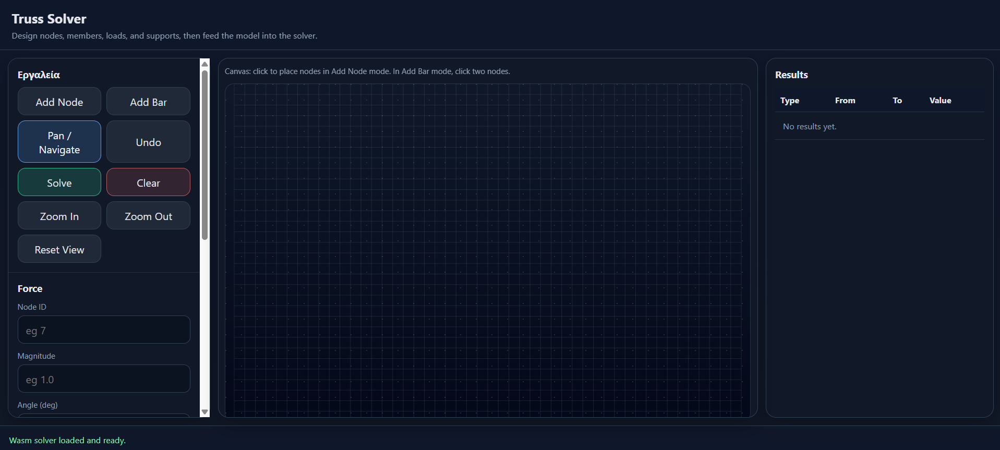
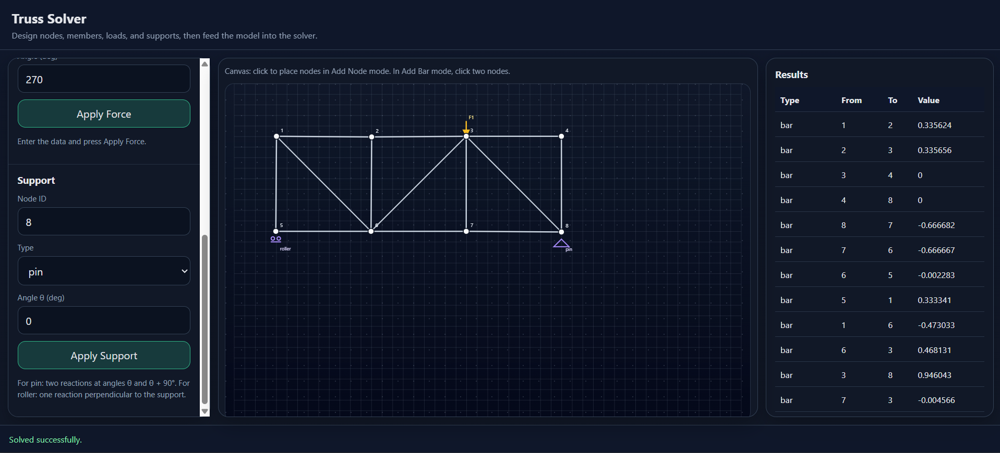

# Truss Solver

A web-based 2D truss solver built with **C++**, **WebAssembly**, **JavaScript**, **HTML** and **CSS**.

The application allows users to create a planar truss structure by adding nodes, bars, external forces and supports. The structural analysis is performed by a C++ solver compiled to WebAssembly using Emscripten.


## Demo

The app runs directly in the browser through a local server.

python -m http.server 8000
Then open: http://localhost:8000


## Features

Interactive 2D canvas for drawing trusses
Add nodes visually
Add bars between nodes
Add external forces with magnitude and angle
Add pin supports
Add roller supports
Undo last action
Clear model
Zoom in / zoom out
Solve statically determinate trusses
Display internal member forces
Display support reactions
Detect unsupported, non-isostatic or unsupported-by-method structures
Error messages for invalid models
C++ backend compiled to WebAssembly


## Technologies Used

C++17 for the structural solver
Emscripten for compiling C++ to WebAssembly
WebAssembly for running the solver in the browser
JavaScript for the frontend logic
HTML / CSS for the user interface


## Project Structure

```text
truss-solver/
│
├── index.html
├── app.js
├── style.css
│
├── web/
│   ├── truss_solver.js
│   └── truss_solver.wasm
│
├── solver/
│   ├── Point.hpp
│   ├── Point.cpp
│   ├── Force.hpp
│   ├── Force.cpp
│   ├── Node.hpp
│   ├── Node.cpp
│   ├── Graph.hpp
│   ├── Graph.cpp
│   ├── TrussSolver.hpp
│   ├── TrussSolver.cpp
│   └── bindings.cpp
│
├── examples/
│   └── main_example.cpp
│
├── README.md
├── LICENSE
└── .gitignore
```


## How It Works

The frontend is responsible for the graphical interface and user interaction. The user creates a truss model by placing nodes, connecting them with bars, applying external forces and defining supports.

The model data is then passed to a C++ solver through WebAssembly bindings. The solver checks whether the structure is suitable for analysis and then computes the unknown member forces and support reactions.

The results are returned to JavaScript and displayed in the results panel.


## Structural Model

The solver currently supports 2D pin-jointed trusses.

Each node has two equilibrium equations:
ΣFx = 0
ΣFy = 0

For a planar statically determinate truss, the basic isostatic condition is:
m + r = 2j

where:
- m = number of bars
- r = number of support reactions
- j = number of joints/nodes

The solver uses this condition to reject structures that are not statically determinate.

## Supported Elements

### Nodes
Nodes represent the joints of the truss.

### Bars
Bars are two-force members connecting two nodes. The solver calculates whether each bar is in tension or compression.

### External Forces
Forces are defined by:
- node ID
- magnitude
- angle in degrees

The angle follows the standard mathematical convention:
- 0°   → positive x direction
- 90°  → positive y direction
- 180° → negative x direction
- 270° → negative y direction

### Supports
The app supports:
- Pin support    → two reaction components
- Roller support → one reaction component


## Solver Limitations

This is the first version of the project. The solver currently has some limitations:

- It supports only 2D trusses.
- It supports only pin-jointed structures.
- It does not solve frames or beam elements.
- It does not solve hyperstatic structures.
- It is intended for statically determinate trusses.
- Some structures may satisfy m + r = 2j but still be geometrically unstable.
- The current method is based mainly on joint equilibrium, so some valid structures may not be solvable if no joint with at most two unknown member forces is available.


## Error Handling

The application detects several invalid cases and displays an error message instead of producing incorrect results.

Examples:
- The graph isn't isostatic
- Unstable support configuration
- Cannot solve node: member directions are dependent
- Cannot solve graph: no joint with at most two unknown member forces

This helps avoid misleading results for invalid or unsupported truss configurations.


## Build Instructions

The C++ solver is compiled to WebAssembly using **Emscripten**.

Before building, make sure Emscripten is installed and activated.

Official installation guide:
https://emscripten.org/docs/getting_started/downloads.html 

After installing Emscripten, clone this repository and go to the project root:

```bash
git clone https://github.com/ChristosPaterakisntua/truss-solver.git  
cd truss-solver
```

### Windows

Activate Emscripten from your local emsdk installation folder:

```bash
cd path\to\emsdk
emsdk_env.bat
```

Then return to the project folder:
```bash
cd path\to\truss-solver
```

Build the WebAssembly module:
```bash
em++ -std=c++17 -O2 ^
-lembind ^
-fexceptions ^
-sDISABLE_EXCEPTION_CATCHING=0 ^
-sALLOW_MEMORY_GROWTH=1 ^
-sENVIRONMENT=web ^
solver\Point.cpp ^
solver\Force.cpp ^
solver\Node.cpp ^
solver\Graph.cpp ^
solver\TrussSolver.cpp ^
solver\bindings.cpp ^
-o web\truss_solver.js
```

This generates:
web/truss_solver.js
web/truss_solver.wasm

### Linux / macOS

Activate Emscripten from your local emsdk installation folder:

```bash
cd path/to/emsdk
source ./emsdk_env.sh
```

Then return to the project folder:
```bash
cd path/to/truss-solver
```

Build the WebAssembly module:
```bash
em++ -std=c++17 -O2 \
-lembind \
-fexceptions \
-sDISABLE_EXCEPTION_CATCHING=0 \
-sALLOW_MEMORY_GROWTH=1 \
-sENVIRONMENT=web \
solver/Point.cpp \
solver/Force.cpp \
solver/Node.cpp \
solver/Graph.cpp \
solver/TrussSolver.cpp \
solver/bindings.cpp \
-o web/truss_solver.js
```

This generates:
web/truss_solver.js
web/truss_solver.wasm


## Running Locally

After building the WebAssembly files, start a local server from the project root:

```bash
python -m http.server 8000
```

Then open:
```bash
http://localhost:8000
```

A local server is required because browsers usually do not load WebAssembly correctly when opening index.html directly from the file system.

If you are using Python 2, use:
```bash
python -m SimpleHTTPServer 8000
```


## Example Valid Model

A simple valid model is a triangular truss with:
3 nodes
3 bars
1 pin support
1 roller support
1 external force on the free node

For this model:
j = 3
m = 3
r = 3

Therefore:
m + r = 3 + 3 = 6
2j = 2 · 3 = 6

So the structure is statically determinate.


## Example Invalid Model

A triangle with no supports is invalid:
j = 3
m = 3
r = 0

Therefore:
m + r = 3
2j = 6

The structure is unsupported and cannot be solved as a static truss.

## Screenshots





## Development Notes

The project consists of two main parts

### C++ Solver

The solver contains the structural model and analysis logic.

Main classes:
- Point
- Force
- Node
- Graph
- TrussSolver

### Web Frontend

The frontend handles:
- drawing
- user interaction
- model editing
- undo actions
- calling the WebAssembly solver
- displaying results
- showing errors


## Future Improvements:

- Export results as CSV / JSON
- Export results as image with the tensions on the bars
- Add example templates
- Add image import functionality:
  - allow the user to upload an image of a truss
  - detect joints, members and supports from the image
  - automatically generate an editable truss model from the detected geometry


## Author

Christos Paterakis

Electrical and Computer Engineering student
National Technical University of Athens


## License

This project is licensed under the MIT License.
See the LICENSE file for more details.