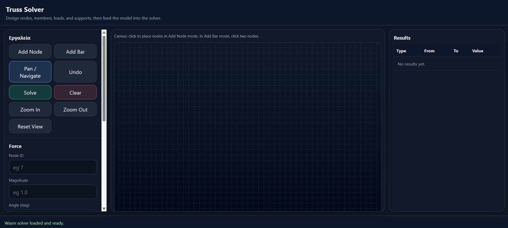
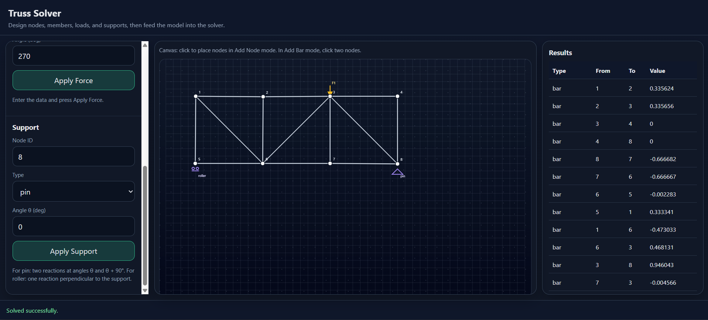

# Truss Solver

A **2D truss structural-analysis engine** written in **C++**, packaged as a
**reusable native library** and also compiled to **WebAssembly** for a browser
frontend built with **HTML / CSS / JavaScript**.

The app lets users draw a planar truss (nodes, bars, external forces, supports)
and runs the analysis with a fast C++ backend. The same C++ core is exposed as a
regular CMake library, so it can be used in other native C++ projects.

## Demo

```bash
python -m http.server 8000
```
Then open:
```bash
http://localhost:8000
```

## Features

- Interactive 2D canvas for drawing trusses
- Add nodes visually
- Add bars between nodes
- Add external forces with magnitude and angle
- Add pin supports
- Add roller supports
- Undo last action
- Clear model
- Zoom in / zoom out
- Solve statically determinate trusses
- Display internal member forces
- Display support reactions
- Detect unsupported, non-isostatic or unsupported-by-method structures
- Error messages for invalid models
- C++ backend compiled to WebAssembly
- Reusable native C++ library (CMake package)

## Technologies Used

- C++17 for the structural solver
- Emscripten for compiling C++ to WebAssembly
- WebAssembly for running the solver in the browser
- JavaScript for the frontend logic
- CMake for building and packaging the native library
- Conan / vcpkg for distributing the native library


## Project Structure

```text
truss-solver/
│
├── # --- Frontend (WebAssembly app) ---
├── index.html                 # Entry page of the browser app
├── app.js                     # Frontend logic & UI interactions
├── style.css                  # Styling
│
├── web/                       # Compiled WebAssembly output (committed)
│   ├── truss_solver.js        # Emscripten JS loader
│   └── truss_solver.wasm      # Compiled C++ solver
│
├── # --- C++ core ---
├── solver/                    # Native library sources
│   ├── Point.{hpp,cpp}
│   ├── Force.{hpp,cpp}
│   ├── Node.{hpp,cpp}
│   ├── Graph.{hpp,cpp}
│   ├── TrussSolver.{hpp,cpp}
│   └── bindings.cpp           # Emscripten bindings (WebAssembly only)
│
├── examples/                  # Small native usage example
│   └── main_example.cpp
│
├── # --- Build & packaging ---
├── CMakeLists.txt             # Library + demo + (wasm) build
├── cmake/                     # CMake package config templates
│   └── truss_solver-config.cmake.in
├── conanfile.py               # Conan recipe (Conan 2)
├── vcpkg.json                 # vcpkg package manifest
├── vcpkg/                     # vcpkg port files
│   └── ports/truss-solver/
│       ├── vcpkg.json
│       └── portfile.cmake
│
├── # --- Project metadata ---
├── assets/                    # Documentation images
├── LICENSE
└── .gitignore
```

> **Note:** `build/` and `build-wasm/` are generated at build time and are
> git-ignored. `web/` contains the committed WebAssembly artifacts.


## How It Works

The project has **two sides** that share the same C++ analysis core.

**Native library** — `solver/` is compiled by CMake into `libtruss_solver`, which
can be linked into any C++ program.

**WebAssembly app** — the same solver is compiled with Emscripten (with
`bindings.cpp` for the JS bridge) into `web/truss_solver.wasm`. The frontend
loads it, builds the model from the canvas, calls the solver, and renders the
results.


## Structural Model

The solver currently supports 2D pin-jointed trusses.

Each node has two equilibrium equations:
ΣFx = 0
ΣFy = 0

For a planar statically determinate truss, the basic isostatic condition is:
m + r = 2j

where:
- m = number of bars
- r = number of support reactions
- j = number of joints/nodes

The solver uses this condition to reject structures that are not statically determinate.

## Supported Elements

### Nodes
Nodes represent the joints of the truss.

### Bars
Bars are two-force members connecting two nodes. The solver calculates whether each bar is in tension or compression.

### External Forces
Forces are defined by:
- node ID
- magnitude
- angle in degrees

The angle follows the standard mathematical convention:
- 0°   → positive x direction
- 90°  → positive y direction
- 180° → negative x direction
- 270° → negative y direction

### Supports
The app supports:
- Pin support    → two reaction components
- Roller support → one reaction component


## Solver Limitations

This is the first version of the project. The solver currently has some limitations:

- It supports only 2D trusses.
- It supports only pin-jointed structures.
- It does not solve frames or beam elements.
- It does not solve hyperstatic structures.
- It is intended for statically determinate trusses.
- Some structures may satisfy m + r = 2j but still be geometrically unstable.
- The current method is based mainly on joint equilibrium, so some valid structures may not be solvable if no joint with at most two unknown member forces is available.


## Error Handling

The application detects several invalid cases and displays an error message instead of producing incorrect results.

Examples:
- The graph isn't isostatic
- Unstable support configuration
- Cannot solve node: member directions are dependent
- Cannot solve graph: no joint with at most two unknown member forces

This helps avoid misleading results for invalid or unsupported truss configurations.


## Building

### Native library (desktop)

Prerequisites: CMake ≥ 3.20 and any C++17 compiler (GCC, Clang, MSVC).

```bash
cmake -S . -B build
cmake --build build
```

This produces:
- `libtruss_solver` (the native library)
- `truss_solver_demo` (the example program)

To install the package (headers, library and CMake config) so it can be consumed
with `find_package`:

```bash
cmake --install build --prefix /some/prefix
```

### WebAssembly module (browser)

Activate Emscripten, then configure with its CMake toolchain via `emcmake`:

```bash
source /path/to/emsdk/emsdk_env.sh          # Linux/macOS
# or: call /path/to/emsdk/emsdk_env.bat     # Windows

emcmake cmake -S . -B build-wasm -DCMAKE_BUILD_TYPE=Release
cmake --build build-wasm
```

This writes `web/truss_solver.js` and `web/truss_solver.wasm` (the Emscripten
toolchain sets `EMSCRIPTEN`, which activates the wasm target in `CMakeLists.txt`).

## Using the Native Library

The C++ core is packaged as a reusable CMake library named `truss_solver`. Three
distribution options are prepared: plain CMake, **Conan** and **vcpkg**.

### Option A - Local CMake (subdirectory or installed package)

Add this repository as a subdirectory:

```cmake
add_subdirectory(path/to/truss-solver)
target_link_libraries(my_app PRIVATE truss_solver)
```

Or install it and use `find_package`:

```bash
cmake -S . -B build
cmake --build build
cmake --install build --prefix /some/prefix
```

```cmake
find_package(truss_solver CONFIG REQUIRED)
target_link_libraries(my_app PRIVATE truss_solver::truss_solver)
```

### Option B - Conan

A Conan 2 recipe (`conanfile.py`) is included. It builds the native library and
publishes the CMake package config, so consumers use it like any Conan dependency.

To create and upload to your own remote:

```bash
conan create . --build=missing
conan remote add myremote <url> --insert
conan upload truss-solver/1.0.0 -r myremote
```

Consumer `conanfile.txt`:

```ini
[requires]
truss-solver/1.0.0

[generators]
CMakeDeps
CMakeToolchain
```

And in your `CMakeLists.txt`:

```cmake
find_package(truss_solver CONFIG REQUIRED)
target_link_libraries(my_app PRIVATE truss_solver::truss_solver)
```

> **ConanCenter:** the recipe already follows ConanCenter conventions
> (`package_type`, `license`, `topics`, `check_min_cppstd`, `cmake_file_name` /
> `cmake_target_name`). To publish there, create a tag/release (e.g. `v1.0.0`) in
> the GitHub repo and open a pull request at https://github.com/conan-io/conan-center-index
> adding the recipe under `recipes/truss-solver/`.

### Option C - vcpkg

vcpkg port files are provided under `vcpkg/ports/truss-solver/`.

To keep the port self-contained, register the project folder as a filesystem
registry in a `vcpkg-configuration.json`:

```json
{
  "registries": [
    {
      "kind": "filesystem",
      "path": "/path/to/truss-solver/vcpkg",
      "baseline": ""
    }
  ]
}
```

Declare it in your `vcpkg.json` manifest:

```json
{
  "name": "my-app",
  "version": "1.0.0",
  "dependencies": [ "truss-solver" ]
}
```

Then `vcpkg install --dependencies` and use `find_package(truss_solver CONFIG REQUIRED)`
with the vcpkg CMake toolchain.

You can also test the port directly from a vcpkg checkout:

```bash
vcpkg install truss-solver --overlay-ports=/path/to/truss-solver/vcpkg/ports
```

> **Official vcpkg registry:** to submit to https://github.com/microsoft/vcpkg,
> create a release in the GitHub repo, point `REF` in `portfile.cmake` to it, fill
> in the real `SHA512`, and open a pull request adding the port under
> `ports/truss-solver/`.

## Running the Web App Locally

First build the WebAssembly module (see [Building](#building)), then serve the
project root over HTTP:

```bash
python -m http.server 8000
```

Then open:
```bash
http://localhost:8000
```

A local server is required because browsers usually do not load WebAssembly correctly when opening index.html directly from the file system.

If you are using Python 2, use:
```bash
python -m SimpleHTTPServer 8000
```


## Example Valid Model

A simple valid model is a triangular truss with:

- 3 nodes
- 3 bars
- 1 pin support
- 1 roller support
- 1 external force on the free node

For this model:

| Symbol | Count |
|--------|-------|
| j (joints) | 3 |
| m (bars) | 3 |
| r (reactions) | 3 |

Therefore:

```
m + r = 3 + 3 = 6
2j    = 2 · 3 = 6
```

The structure is statically determinate.

## Example Invalid Model

A triangle with no supports is invalid:

| Symbol | Count |
|--------|-------|
| j (joints) | 3 |
| m (bars) | 3 |
| r (reactions) | 0 |

Therefore:

```
m + r = 3
2j    = 6
```

The structure is unsupported and cannot be solved as a static truss.

## Screenshots





## Development Notes

The project consists of two main parts that share the same C++ solver.

### C++ Solver

The solver (`solver/`) contains the structural model and analysis logic.

Main classes:
- Point
- Force
- Node
- Graph
- TrussSolver

The same code is built two ways:
- as a **native CMake library** (`truss_solver`),
- as a **WebAssembly module** (via `bindings.cpp` + Emscripten).

### Web Frontend

The frontend (`index.html`, `app.js`, `style.css`) handles:
- drawing
- user interaction
- model editing
- undo actions
- calling the WebAssembly solver
- displaying results
- showing errors


## Future Improvements:

- Export results as CSV / JSON
- Export results as image with the tensions on the bars
- Add example templates
- Add image import functionality:
  - allow the user to upload an image of a truss
  - detect joints, members and supports from the image
  - automatically generate an editable truss model from the detected geometry


## Author

Christos Paterakis

Electrical and Computer Engineering student
National Technical University of Athens


## License

This project is licensed under the MIT License.
See the LICENSE file for more details.